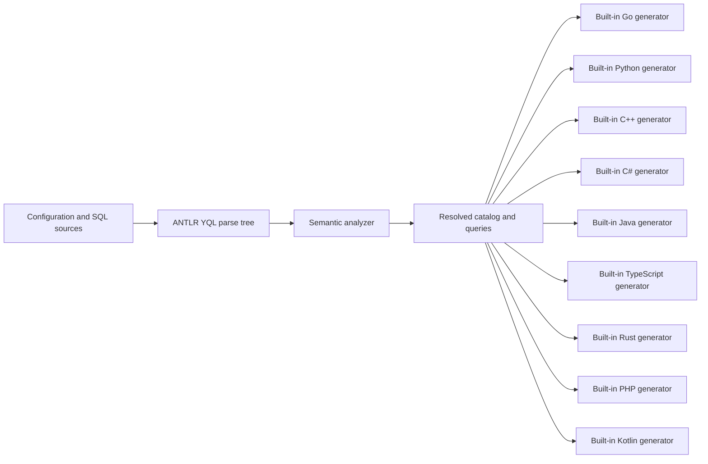

# Standalone architecture

`internal/source` loads files and migration inputs. `internal/analyzer` owns parsing, catalog construction, scopes, type checking and diagnostics. Small accessors over ANTLR contexts may hide grammar details, but do not construct another recursive syntax tree. One SELECT semantic core resolves expressions, wildcards, sources, predicates and grouping for both read queries and DML SELECT sources. INSERT/UPSERT with an explicit target list and explicit projection matches source columns positionally, regardless of optional source aliases; UPDATE/DELETE ON SELECT matches result names and requires every primary-key field with a compatible declared type. `internal/yql/builtins` provides strict function, arithmetic, cast and common-type rules over resolved types. The analyzer supplies expression scope and aggregation context; neither package constructs an intermediate AST.

VALUES and SET use the same scalar expression resolver as SELECT. UPDATE supplies the target relation; VALUES supplies only parameter/local bindings. Arithmetic lookup follows only grammar wrappers spanning the complete expression, rather than scanning operand subtrees. ANTLR operator contexts preserve precedence and scalar parentheses are unwrapped only after excluding tuples, lambdas and subqueries. DML values resolve supported comparisons with their nullability. Assignment validation is shared with SELECT-backed DML and permits exact types, optional destinations, contextual NULL and lossless integer widening; it does not insert casts or evaluate SQL. Direct parameter assignment inference remains separate from resolving operands in compound expressions.

IN subqueries reuse the SELECT semantic core with an independent relation scope. Outer column, predicate, inference and aggregate traversals stop at nested SELECT boundaries; shared external parameter types remain consistent across scopes. Tuple keys are resolved only for the supported IN operands and are not exposed as a new generated parameter/result contract. Per-SELECT resolved bindings accompany the original ANTLR contexts so the jOOQ renderer can preserve shadowed aliases without reanalyzing SQL.

Multi-DML `:exec` scripts reuse the statement analyzer for each top-level DML context from one parse. Leading declarations, scalar locals and external parameter constraints are shared; relation scopes remain per statement. Resolved token bindings and wildcard replacements retain their positions in the complete script, which remains one analyzed query and one runtime execution call per attempt. Scripts with result-producing statements and multi-statement affected-row counts are outside this contract.

`internal/model` is the boundary between analysis and generation: YQL type identity, parameters, result sets and source locations. Nullability is an `Optional` type, compound type metadata is retained, and Struct fields have name-based identity independent of declaration order. `Bytes` normalizes to binary `String`; `Text` normalizes to Unicode `Utf8`. A table catalog and a query projection are distinct: `SELECT name` does not generate the whole table. Projection columns retain their API name and, where different, the exact YDB result name in `WireName`. For example, an unaliased `b.title` in a join is returned as `b.title`. Name-based decoders use `Column.ResultName()`, which selects `WireName` when present and otherwise `Name`; positional decoders retain the analyzed projection order. Generated API fields continue to use `Name`. `AnalyzedQuery.SQL` contains executable YQL with supported wildcard projections expanded into explicit quoted columns; unnamed computed expressions combined with a wildcard receive explicit aliases preserving their original YDB names, so expansion cannot change references such as ORDER BY column1. Declarations and text outside those wildcard replacements and alias insertions are retained. The analyzer records explicitly declared parameter names in `DeclaredParameters`. Generators retain user-written declarations in executable SQL. SDK adapters use this metadata to avoid duplicate declarations while binding inferred parameters with their resolved types. Parameter names omit the leading `$`; their types and result column types must be resolved. TypeScript result properties use `Column.ResultName()` verbatim, including qualified names as quoted properties. No target-specific SQL alias rewriting or result-key conversion is needed for this target. `analyzer.Analyze` returns an error whenever its result contains diagnostics.

The language packages in `internal/codegen` produce files from that resolved model. They handle naming, runtime-specific parameter binding, result decoding and resource lifetimes. They do not analyze SQL or load external code. jOOQ uses typed JDBC execution for structured batches and explicitly declared queries, with resolved table references rendered through jOOQ to preserve table mappings. For the jOOQ DSL target, `AnalyzedQuery.Syntax` retains ANTLR contexts and analyzer-resolved column/table bindings for the executable SQL, including the positions after wildcard expansion. The renderer walks these contexts directly; it does not reparse text or construct a second AST. Unsupported DSL constructs fail in the target without restricting other generators. Lexical adaptation of parameter placeholders for a driver is separate from semantic query analysis and must preserve strings, comments and identifiers. `internal/codegen/jdbc` implements shared SQL rendering for Java and Kotlin; their SDK binding and result decoding remain in each generator.

`internal/cli` connects these stages for all commands. It parses concrete signatures from `sql[].analyzer.functions` into `model.Type` contracts and gives a separately validated registry to each `sql` entry; all generators for that entry consume the same analysis. Unknown functions never receive an inferred fallback, and configured signatures are trusted offline contracts rather than evidence of server availability or complete UDF coverage. All configured outputs are prepared before writes start. Each file is replaced through a temporary sibling; this protects individual files from interrupted writes, but does not promise a filesystem transaction covering every output. Before writing or comparing, the CLI checks current output directories for obsolete files with the sqlc-ydb generated header. It reports those files for manual removal; see [output ownership](../docs/compatibility.md#output-ownership).

## Compilation boundary

Static absolute TablePathPrefix resolution belongs to the shared analyzer. A named query or schema source has one validated prefix; different named queries and schema files do not inherit it. The catalog stores resolved physical paths while relation aliases retain their authored SQL identity. Resolved table-reference token bindings travel with executable syntax for generators such as jOOQ, so table mapping does not reimplement path semantics. Source pragmas and authored table references remain in executable YQL; wildcard reanalysis refreshes the token bindings. The compiler rejects conflicting or late prefixes instead of modeling statement-local prefix changes.

`analyzer.Analyze(schema, queries)` is the default compilation entry point; `AnalyzeWithOptions(schema, queries, Options)` accepts an explicit function contract with a fixed arity. The CLI invokes `AnalyzeWithOptions` for offline analysis or `AnalyzeWithDatabase` for connected analysis once per `sql` configuration entry, then gives the shared resolved result to every selected generator. `compile` stops after analysis. Planned macro processing belongs inside this boundary; see [the roadmap](roadmap.md). A separate compiler package is unnecessary while the analyzer owns these stages.

`model.Type` owns structural equality and YQL type formatting. The analyzer, built-in function resolver and Python model reuse checks share those operations. Go's native and database/sql generators bind root Struct parameters and list-of-Struct batches through generated named types; both bind scalar List parameters, while nested Struct/List fields remain unsupported. SDK-specific type mapping stays in each generator.

The parser is pinned in `go.mod` to an official `ydb-platform/yql-parsers` release. See [provenance](../docs/provenance.md) for parser revisions and upstream references, and [decisions](decisions.md) for lasting architectural choices.

## Database-assisted analysis

The CLI scopes one `internal/database` connection to each opted-in SQL entry, before any generator runs. The transport uses official public YDB protobuf services and gRPC directly; application runtime SDK dependencies remain in examples and tests. It reads table metadata and compiles queries using EXPLAIN without executing application SQL. The internal analyzer database interface is an I/O seam for this one implementation and its tests, not an external engine protocol.

Connected analysis sends each original named query to EXPLAIN before table discovery or local query semantics; it does not classify complexity or synthesize declarations. Users explicitly declare external parameter types, and server parameter diagnostics include a DECLARE hint. Without local schema inputs, the analyzer then discovers direct physical table references from the original ANTLR contexts and obtains their resolved column, primary-key and secondary-index metadata. `VIEW` selects an index on the base table; its name is never included in the path sent to DescribeTable. The catalog retains ordinary index kind, key columns and covering columns for validation, without inventing separate index relations. With local schema inputs, it checks the local catalog against live metadata before query analysis. The same semantic resolver handles both modes and expands supported SELECT and RETURNING wildcards before generators receive the resolved model. Local catalog order is preserved when schema inputs exist; schema-free discovery retains DescribeTable order. Explicit columns in executable SQL establish result order without sorting the entire catalog. Rewritten queries are parsed and resolved once more inside this shared compilation boundary so ANTLR coordinates and bindings agree with executable SQL; unchanged queries use the original path. Every selected generator receives one shared result. See [the public contract](../docs/database-analysis.md) for ordering, supported syntax, authentication and offline overrides.
