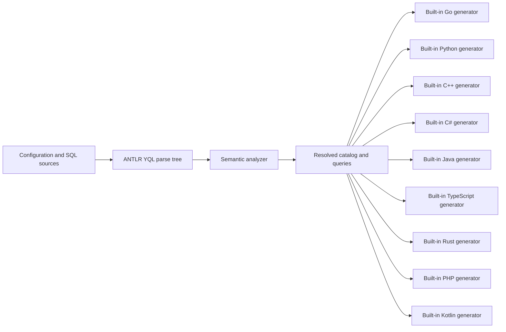

# Standalone architecture

`internal/source` loads files and migration inputs. `internal/analyzer` owns parsing, catalog construction, scopes, type checking and diagnostics. Small accessors over ANTLR contexts may hide grammar details, but do not construct another recursive syntax tree. `internal/yql/builtins` provides strict function, cast and common-type rules over resolved types. The analyzer supplies expression scope and aggregation context; neither package constructs an intermediate AST.

`internal/model` is the boundary between analysis and generation: YQL type identity, parameters, result sets and source locations. Nullability is an `Optional` type, and compound type metadata is retained. A table catalog and a query projection are distinct: `SELECT name` does not generate the whole table. Projection columns retain their API name and, where different, the exact YDB result name in `WireName`. For example, an unaliased `b.title` in a join is returned as `b.title`. Name-based decoders use `Column.ResultName()`, which selects `WireName` when present and otherwise `Name`; positional decoders retain the analyzed projection order. Generated API fields continue to use `Name`. `AnalyzedQuery.SQL` retains executable YQL and its declarations. The analyzer also derives `SQLWithoutDeclarations` from ANTLR token spans for SDKs that synthesize `DECLARE` from typed parameters, currently TypeScript and the JDBC-based Java and Kotlin adapters. This removes only declaration syntax; comments, literals and local bindings remain intact. Generators do not independently reparse or strip declarations. Parameter names omit the leading `$`; their types and result column types must be resolved. TypeScript result properties use `Column.ResultName()` verbatim, including qualified names as quoted properties. No SQL alias rewriting or result-key conversion is needed for this target. `analyzer.Analyze` returns an error whenever its result contains diagnostics.

The language packages in `internal/codegen` produce files from that resolved model. They handle naming, runtime-specific parameter binding, result decoding and resource lifetimes. They do not analyze SQL or load external code. For the jOOQ DSL target, `AnalyzedQuery.Syntax` retains the original ANTLR contexts and analyzer-resolved column/table bindings. The renderer walks these contexts directly; it does not reparse text or construct a second AST. Unsupported DSL constructs fail in the target without restricting other generators. Lexical adaptation of parameter placeholders for a driver is separate from semantic query analysis and must preserve strings, comments and identifiers. `internal/codegen/jdbc` implements the shared positional-parameter contract for Java and Kotlin; their SDK binding and result decoding remain in each generator.

`internal/cli` connects these stages for all commands. All configured outputs are prepared before writes start. Each file is replaced through a temporary sibling; this protects individual files from interrupted writes, but does not promise a filesystem transaction covering every output. Before writing or comparing, the CLI checks current output directories for obsolete files with the sqlc-ydb generated header. It reports those files for manual removal; see [output ownership](../docs/compatibility.md#output-ownership).

## Compilation boundary

`analyzer.Analyze(...) -> model.AnalysisResult` is the compilation entry point. The CLI invokes it once per `sql` configuration entry and gives the result to every selected generator. `compile` stops after analysis. Planned macro processing belongs inside this boundary; see [the roadmap](roadmap.md). A separate compiler package is unnecessary while the analyzer owns these stages.

`model.Type` owns structural equality and YQL type formatting. The analyzer, built-in function resolver and Python model reuse checks share those operations. SDK-specific type mapping stays in each generator.

The parser is pinned in `go.mod` to an official `ydb-platform/yql-parsers` release. See [provenance](../docs/provenance.md) for parser revisions and upstream references, and [decisions](decisions.md) for lasting architectural choices.
