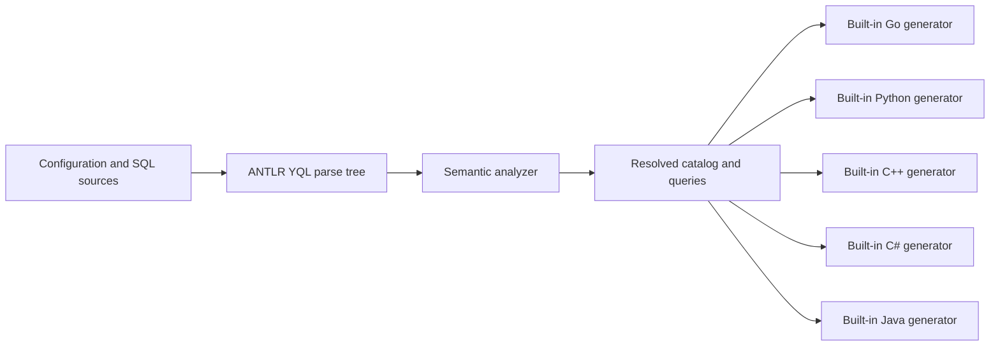

# Standalone architecture

`internal/source` loads files and migration inputs. `internal/analyzer` owns
parsing, catalog construction, scopes, type checking and diagnostics. Small
accessors over ANTLR contexts may hide grammar details, but do not construct
another recursive syntax tree.

`internal/model` is the boundary between analysis and generation: YQL type
identity, parameters, result sets and source locations. Nullability is an
`Optional` type, and compound type metadata is retained. A table catalog and a
query projection are distinct: `SELECT name` does not generate the whole table.

The language packages in `internal/codegen` produce files from that
resolved model. They handle naming, runtime-specific parameter binding, result
decoding and resource lifetimes. They do not analyze SQL or load external code.
Lexical adaptation of parameter placeholders for a driver is separate from
semantic query analysis and must preserve strings, comments and identifiers.

`internal/cli` connects these stages for all commands. All configured outputs are
prepared before writes start. Each file is replaced through a temporary sibling;
this protects individual files from interrupted writes, but does not promise a
filesystem transaction covering every output.

## Where is the compiler?

Compilation is present as a stage, but there is currently no `internal/compiler`
package or `Compiler` object. Its responsibilities are distributed as follows:

| Responsibility | Current owner |
| --- | --- |
| Resolve source paths, order migrations, keep Up sections | `internal/source` |
| Parse YQL, apply schema statements to the catalog, analyze named queries | `internal/analyzer` |
| Return resolved catalog, parameters, result columns and diagnostics | `model.AnalysisResult` |
| Invoke analysis once per `sql` configuration entry, then its generators | `internal/cli.prepare` |
| Render source files for each selected language/runtime | `internal/codegen/*` |

In upstream sqlc, `internal/compiler.Compiler` owns catalog/query compilation,
parser selection, analysis and SQL rewrites; code generation is dispatched by
`internal/cmd`. A compiler therefore is not another syntax representation and
does not imply an intermediate AST or a native-code backend. The comparable
boundary here is `analyzer.Analyze(...) -> model.AnalysisResult`.

Macro handling and semantic analysis must share one compilation boundary before
generation. This can remain in `internal/analyzer`; a separate `internal/compiler`
package is an implementation option, not a requirement. Extract orchestration
only if the added responsibilities justify it. The CLI retains configuration,
source/output paths and file IO. No engine registry, plugin interface or second
AST is needed. See [the compiler roadmap](roadmap.md) for ordering and acceptance
criteria.

Reference: upstream sqlc
[`Compiler`](https://github.com/sqlc-dev/sqlc/blob/23e357a414310aa8846e64624da8b8a626b3a610/internal/compiler/engine.go)
and [generation dispatch](https://github.com/sqlc-dev/sqlc/blob/23e357a414310aa8846e64624da8b8a626b3a610/internal/cmd/generate.go).

## Development decisions

- Develop the independent implementation in the existing repository. Do not
  maintain a source fork that requires repeated upstream merges.
- Preserve the analyzer stage. The old external-engine implementation omitted
  it and cannot serve as the semantic correctness baseline.
- Do not add an intermediate AST. The typed analysis result is necessary for
  code generation and is not a syntax representation.
- Built-in generators cover Go, Python, C++, Java, and C#. JS/PHP/Rust follow later. SDK
  maintainers are already in the product team and can review generated APIs.
- Track upstream product behavior and selectively adapt relevant tests. Record
  source provenance and retain license notices whenever code is copied.

The parser is pinned in `go.mod` to `ydb-platform/yql-parsers` commit
`2fbaa5e71a03` (updated from YQL `d9544073fd13`), using its generated ANTLR4 Go parser. No local sibling checkout
or `replace` directive is needed.
