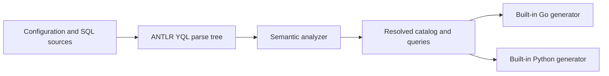

# Standalone architecture

`internal/source` loads files and migration inputs. `internal/analyzer` owns
parsing, catalog construction, scopes, type checking and diagnostics. Small
accessors over ANTLR contexts may hide grammar details, but do not construct
another recursive syntax tree.

`internal/model` is the boundary between analysis and generation: YQL type
identity, parameters, result sets and source locations. Nullability is an
`Optional` type, and compound type metadata is retained. A table catalog and a
query projection are distinct: `SELECT name` does not generate the whole table.

`internal/codegen/golang` and `internal/codegen/python` produce files from that
resolved model. They handle naming, runtime-specific parameter binding, result
decoding and resource lifetimes. They do not analyze SQL or load external code.
Lexical adaptation of parameter placeholders for a driver is separate from
semantic query analysis and must preserve strings, comments and identifiers.

`internal/cli` connects these stages for all commands. All configured outputs are
prepared before writes start. Each file is replaced through a temporary sibling;
this protects individual files from interrupted writes, but does not promise a
filesystem transaction covering every output.

## Development decisions

- Develop the independent implementation in the existing repository. Do not
  maintain a source fork that requires repeated upstream merges.
- Preserve the analyzer stage. The old external-engine implementation omitted
  it and cannot serve as the semantic correctness baseline.
- Do not add an intermediate AST. The typed analysis result is necessary for
  code generation and is not a syntax representation.
- Start with Go and Python. C++, Java, C#, then JS/PHP/Rust follow later. SDK
  maintainers are already in the product team and can review generated APIs.
- Track upstream product behavior and selectively adapt relevant tests. Record
  source provenance and retain license notices whenever code is copied.

The parser is pinned in `go.mod` to `ydb-platform/yql-parsers` commit
`2fbaa5e71a03` (updated from YQL `d9544073fd13`), using its generated ANTLR4 Go parser. No local sibling checkout
or `replace` directive is needed.
